# 🛡️ helucryptic-android

<p align="center">
  
  
  
  
</p>

<p align="center">
  <a href="https://github.com/Cryptic-Mage/helucryptic"><strong>🌐 Main Desktop Repo &amp; Protocol Spec</strong></a>
</p>

> **True peer-to-peer security in the palm of your hand.**  
> A native Android client for the Helucryptic ecosystem, featuring serverless end-to-end encrypted messaging, voice calls, and room sharing that bypasses the cloud entirely.

Most mobile messengers routing encrypted data still rely on central server relays. **helucryptic-android** behaves differently. A signaling server operates for only a few seconds to orchestrate the WebRTC connection handshake-acting as a digital matchmaker-and then **exits the path**. Every text, audio packet, and file is routed **straight from your device to theirs**.

---

## 🗺️ Protocol & Traversal Loop

Below is the animated visualization of the signaling handshake, traversal negotiation, and direct secure peer-to-peer WebRTC connection:



---

## ✨ Features

* **📱 Jetpack Compose & Material 3** – A sleek, dark-themed UI adhering to modern Android design guidelines, including custom Pill navigators and intuitive state transitions.
* **💬 P2P Encrypted Chats** – Real-time message exchanges using **PASETO v4.local** (XChaCha20-Poly1305 equivalent) directly over WebRTC DataChannels.
* **🎙️ Low-Latency Voice Calls** – Direct voice track streaming with active microphone capture and playback routing fully implemented over WebRTC.
* **👥 Group Rooms with Hub Failover** – Connect up to 4 peers in ephemeral group rooms. If the elected media-routing host (the **Hub**) drops out, the Android client automatically participates in re-electing a new Hub and seamlessly restores connection.
* **🧬 Trusted-On-First-Use (TOFU) Pinning** – Public identity keys are pinned on first contact. If a contact's fingerprint changes, the app locks the connection and displays a warning to prevent MITM attacks.
* **🔗 QR Code Invitations** – Integrated with **ZXing** to let you generate invitation QR codes or scan your friends' invite codes (`HELU-INV1:`) for zero-configuration matchmaking.
* **🗄️ Secure Local Persistence** – Room database for message history and contacts, with application configurations written safely to Jetpack DataStore.
* **🔌 Traversal Resilience** – Advanced network negotiation via STUN/TURN and self-healing reconnection policies for cellular connections and firewalls.

---

## 🔒 The Cryptographic Stack

The Android client matches the wire format of the desktop application using **BouncyCastle** for native JVM performance and cryptographic correctness:

| Component | Primitive / Standard | Description |
| :--- | :--- | :--- |
| **Key Agreement** | `X25519 3-DH` | Ephemeral & static DH key agreement generating fresh session keys per connection. |
| **Session Key Derivation** | `HKDF-SHA256` | Derives the symmetric key with info context `"helucryptic-session-v2"`. |
| **Identity / Signatures** | `Ed25519` | Key fingerprint generation and PASETO v4.public token signatures. |
| **Symmetric Encryption** | `PASETO v4.local` | Wire-compatible XChaCha20 + BLAKE2b-MAC AEAD token formatting. |
| **Local Storage Wrap** | `Android Keystore` | Cryptographically pins profile identity keys using OS-level keystore wrapping. |

---

## 📦 Project Structure & Layout

The codebase follows Clean Architecture principles with Hilt dependency injection:

```
app/src/main/java/com/helucryptic/android/
│
├── 📁 crypto/            # PASETO v4, X25519, Ed25519 keys, and identity manager
│   ├── CryptoManager.kt  # Performs 3-DH, signature validation, and HKDF
│   ├── PasetoV4.kt       # Wire-compatible PASETO local/public codec
│   └── IdentityStore.kt  # Manages local profile identity storage
│
├── 📁 data/              # Persistence and local database engines
│   ├── 📁 datastore/     # App settings preferences (DataStore)
│   ├── 📁 db/            # Room database (RoomEntity, AppDatabase)
│   └── 📁 repository/    # Repositories for messaging and contact registries
│
├── 📁 domain/            # Core business models
│
├── 📁 signaling/         # WebSocket-based matchmaking client
│   ├── SignalingClient.kt# OkHttp WebSocket connector relaying SDP & ICE candidates
│   └── SignalingMessage.kt# Handshake message schemas
│
├── 📁 webrtc/            # WebRTC core connection loop
│   ├── WebRtcEngine.kt   # Instantiates PeerConnections, MediaStreams, and tracks
│   ├── P2PChannelManager.kt# Manages data channels for text message flow
│   ├── RoomManager.kt    # Coordinates group room state
│   └── HubElection.kt    # Logic for electing media router in group rooms
│
└── 📁 ui/                # UI screens using Jetpack Compose
    ├── 📁 navigation/    # App navigation graphs & Pill navbar
    ├── 📁 onboarding/    # Keys generation on first-run launch
    ├── 📁 chat/          # DMs list and conversational threads
    ├── 📁 room/          # Group room screens and participant views
    ├── 📁 contacts/      # Contact registries and details card
    ├── 📁 settings/      # Server URLs, TURN configs, and backup exports
    └── 📁 call/          # Active WebRTC voice call dashboard
```

---

## 🚀 Getting Started

To compile and launch the Android client locally, make sure you have the **Android SDK (Compile SDK 35, Min SDK 26)** and **Java 17** installed.

### 1. Configure Local Properties

Create a `local.properties` file in the root directory (or copy `local.properties.example`) and fill in your connection configs:

```properties
# Signaling target (10.0.2.2 points to localhost if running inside an Emulator)
HELUCRYPTIC_SIGNALING_URL=ws://10.0.2.2:8000

# Optional server verification password
HELUCRYPTIC_SERVER_PASSWORD=my_secure_password

# Traversal configurations (STUN/TURN)
HELUCRYPTIC_TURN_URL=turn:your-turn-server.com:3478
HELUCRYPTIC_TURN_USERNAME=my-turn-username
HELUCRYPTIC_TURN_PASSWORD=my-turn-password
```

### 2. Build and Install

Use Gradle to compile the Debug APK:

```bash
# Unix / macOS
./gradlew assembleDebug

# Windows PowerShell
.\gradlew.bat assembleDebug
```

The compiled APK will be output to `app/build/outputs/apk/debug/app-debug.apk`.

Alternatively, open the project in **Android Studio** and run it directly on an Emulator or connected physical device.

---

## 🔄 Reconnection & Re-routing Policies

The Android app implements three layers of recovery to protect mobile connections:

1. **Renegotiation**: If the WebRTC peer connection experiences packet drop or network switching (e.g. Wi-Fi to cellular), it triggers automatic ICE renegotiation silently.
2. **WebSocket Auto-Reconnect**: If the signaling connection to the server drops, an exponential backoff loop automatically reconnects the socket and re-joins the active room.
3. **Active Hub Election**: In group rooms, peers monitor each other's status. If the current Hub goes offline, the remaining peers run a distributed election algorithm to pick the next best Hub and reconnect their media streams automatically.

---

## 💻 Cross-Compatibility

This client is fully wire-compatible with the [Helucryptic Desktop Client](https://github.com/Cryptic-Mage/helucryptic).

* To start a session, create a Room on either client.
* Generate an Invite Code or scan the QR Code using the Android camera.
* The Android client will automatically parse the invite payload, resolve the signaling endpoint, perform the PASETO handshake, and establish a direct connection.

---

## 🛡️ Security Boundaries

* **Metadata**: The signaling server only receives encrypted SDP tokens and ICE candidates. No room key or session key is ever sent to the server.
* **Android Keystore Protection**: Private identity keys are kept in private sandbox storage. You can perform security exports in Settings to back up your identity keys.
* **Relay Gating**: Incoming messages and calls from unverified fingerprints are automatically flagged or gated based on your profile privacy levels.
